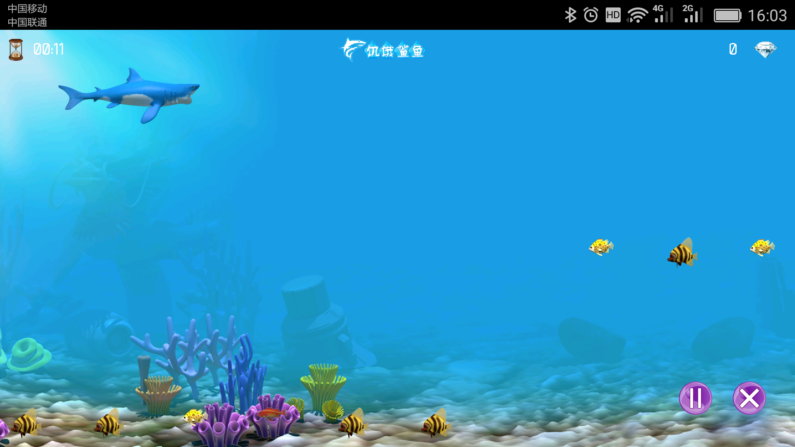

# Hungry Shark

饥饿鲨鱼

#### Powered by [JustWeEngine](https://github.com/lfkdsk/JustWeEngine)

感谢JustWeEngine, 采用该引擎完成了一个工作任务，需要在原生的APP中，嵌入几个小游戏，而且小游戏与原生APP需要有频繁的各种数据交互。
如果采用JNI的方式去移植cocos2dx之类的C++游戏引擎，费时费力。幸得JustWeEngine这个小巧的纯Java开源引擎帮助，顺利完成了项目任务。

在这里把其中一个小游戏整理了一下，发布出来，供有需要的其他朋友参考，尽一点绵薄之力。

## 简介
主要区别点如下： 

1、把原先基于的Activity引擎，改到了Fragment,这样使用起来更加灵活，方便从我项目中的Activity中获取数据，也更方便在保留数据的前提下，和其他界面进行切换；
2、修复了多个Button点击时，原引擎每次都会返回第一个按钮的bug；
3、FramAnimation中添加了间隔参数，方便加载大于1秒的较长帧动画；
4、修改了BaseSprite修复了scale倍数不正确，以及缩放后显示异常的问题；
5、修改了ZoomAnimation实现了Sprite的缩放动画；
6、由于是项目，所以把引擎移植到Eclipse工程里面，也给需要用Eclipse的一个参考。

## 安装
你需要一部Android手机，或者安卓虚拟机，并且它搭载Android4.0.3(API15)及以上的系统。
下载安装包或克隆源代码并使用SDK编译。
拷贝安装包到手机上 安装即可。

## 操作
1、手势直接控制鲨鱼，吃掉小鱼，每吃掉一条小鱼，得分加10分；
2、当连续吃了3条小鱼后，鲨鱼会缩小0.5倍；
3、当连续放过3条小鱼后，鲨鱼会放大0.5倍；
4、点击暂停按钮，可以暂停游戏；
5、点击退出按钮，退出游戏。

## 截图
